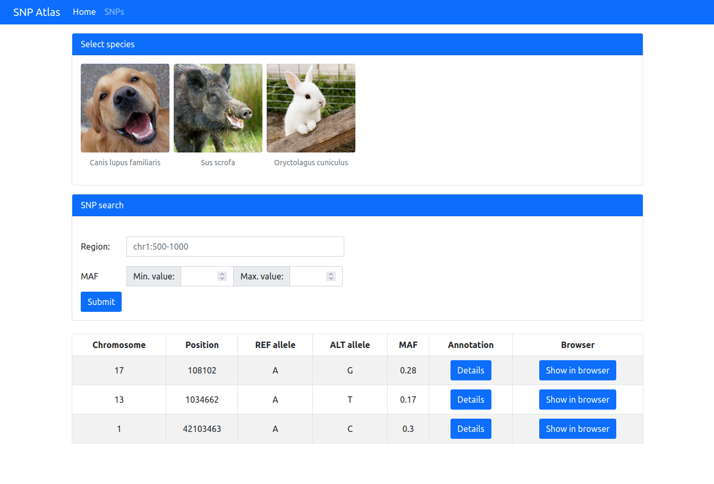
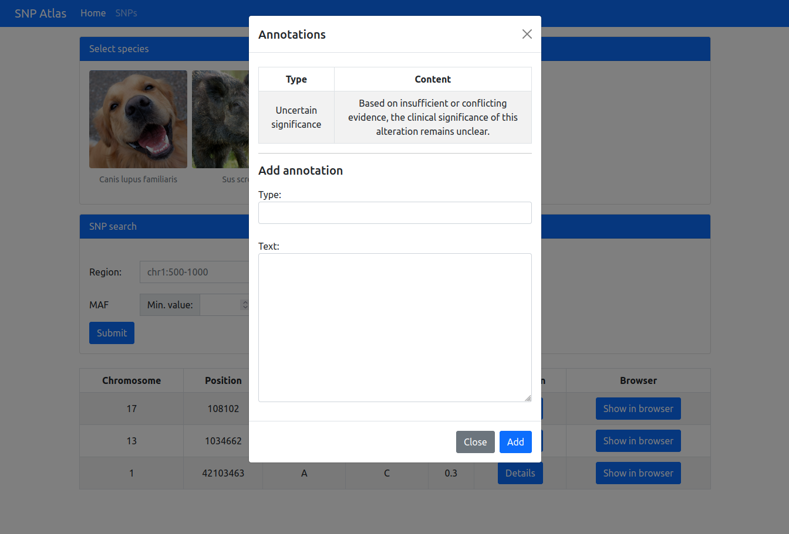

# SNP database
A django application that allows you to search single nucleotide polymorphisms for different species and annotate variants. All data is synthetic.

<i>App main page</i>

<i>Browsing and adding annotations</i>

## Setup

### Requirements
* Python version 3.10
* Django version 4.2

### Run app
Go to project source directory and type
`python3 manage.py runserver`
